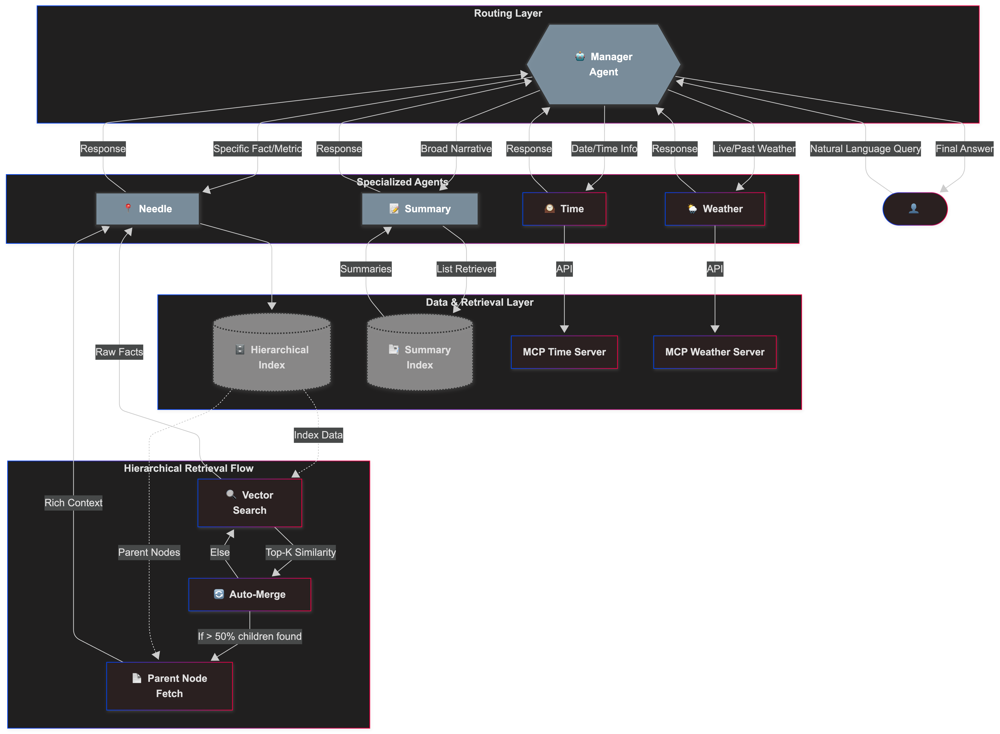

# Insurance Claim Timeline Retrieval System

A **Multi-Agent RAG System** built with **LlamaIndex** to investigate complex insurance claims. It combines hierarchical retrieval for specific facts with summary indexing for high-level context, all orchestrated by a routing agent.

---

## 🏗️ Architecture Explanation

The system follows a **Hub-and-Spoke Agentic Architecture**:

- **Manager Agent (Router)**: The central brain. It analyzes the user's intent and routes queries to the most appropriate sub-agent or tool.
- **Specialized Sub-Agents**:

  - **Needle Agent**: Uses the Hierarchical Index to find precise "needle-in-a-haystack" facts.
  - **Summary Agent**: Uses the Summary Index to generate broad, narrative answers.

- **MCP Tools**: Integration of deterministic tools (e.g., Python functions) for calculations.



---

## 📊 Data Segmentation Decisions

To handle the complexity of an insurance claim file (which contains dense logs, receipts, and narratives), we employ a **Multi-Granularity Strategy**:

1. **Granularity**: We do not treat the document as a flat list of pages. We segment it into:

   - **Roots (2048 tokens)**: Large context windows (e.g., full incident reports).
   - **Intermediates (512 tokens)**: Logical sections (e.g., a specific table of receipts).
   - **Leaves (128 tokens)**: Small, precise snippets (e.g., a single log entry timestamp).

2. **Why?**:

   - Small chunks allow us to match specific queries ("What happened at 10:22 AM?") with high similarity scores.
   - Large chunks provide the necessary context for the LLM to generate a coherent answer once the relevant section is found.

## 🧠 Segmentation & Retrieval Strategy

This section details our configuration choices to maximize retrieval accuracy (refer to `src/config.py`).

### 1. Chunk Size Strategy

We employ a **Hierarchical Node Parser** with three levels of granularity:

- **Roots (2048 tokens)**: Capture broad context (e.g., full incident reports).
- **Intermediates (512 tokens)**: Logical sections (e.g., tables, specific clauses).
- **Leaves (128 tokens)**: Precise snippets to match granular queries.

**Why?** Small chunks (128) enable high-similarity matching for specific facts ("What is the deductible?"), while large chunks (2048) provide the LLM with the full surrounding context needed to answer correctly.

### 2. Overlap Strategy

We use a **20-token overlap** between chunks.

- **Reasoning**: Prevents semantic information from being "cut" at the boundary of a chunk. This ensures that a sentence split across two chunks is still intelligible in at least one of them.

### 3. Hierarchy Depth Rationale

We chose a **depth of 3** (Root -> Intermediate -> Leaf).

- **Why?**: A depth of 2 is often too shallow (jumping from a small sentence to a massive document), losing the specific section context. A depth of 4+ becomes computationally expensive to index. Depth 3 offers the perfect balance: retrieving the **specific section** (512 tokens) is often more useful than just the sentence or the entire document.

### 4. How Segmentation Improves Recall

We utilize **Auto-Merging Retrieval**:

- **Mechanism**: If the system retrieves multiple "Leaf" nodes that belong to the same parent, it automatically **discards the leaves and replaces them with the Parent Node**.
- **Impact on Recall**: This dramatically improves recall by providing the **complete context** (the paragraph) rather than fragmented sentences. It ensures the model sees the "whole picture" when multiple relevant facts are clustered together.

### 5. Reviewing the Mechanism (Trace Example)

To empirically prove the benefit of our strategy, we ran a controlled experiment comparing Flat vs. Hierarchical retrieval on the query _"What is the deductible amount?"_.

**Results:**

| Metric           | Flat (Naive)     | Hierarchical (Ours) | Impact                       |
| :--------------- | :--------------- | :------------------ | :--------------------------- |
| **Merged?**      | ❌ No            | ✅ **Yes**          | 7 leaves merged into parents |
| **Context Size** | ~180 chars       | **~417 chars**      | **+133% Context**            |
| **Content**      | Fragmented lines | Full Paragraphs     | Complete readability         |

**Conclusion**: The hierarchical system recognized that the small fragments belonged together and served the LLM the **entire section**, proving that "Auto-Merging" successfully reconstructs context.

---

## 🤖 Agent Design + Prompt Structure

### Manager Agent (Router)

- **Type**: ReAct / Tool-Use Agent with **Chain-of-Thought (CoT)** reasoning.
- **Prompt**: "You are a Router. Think step-by-step. Use 'needle_expert' for facts. Use 'summary_expert' for broad overviews."
- **Robustness**:

  - **Few-Shot Examples**: The system prompt includes concrete examples of user queries and the expected thought process/tool selection.
  - **Prompts as Functions**: All prompts are encapsulated in `src/prompts.py` using `PromptTemplate` objects, treating them as code artifacts rather than magic strings.

- **Goal**: Prevent "hallucinated summaries" when the user asks for specific data.

### Sub-Agents

- **Needle Agent**:

  - **Description**: "The DEFAULT tool. Use for facts, dates, costs, names."
  - **Tool**: `QueryEngineTool` -> `AutoMergingRetriever`.

- **Summary Agent**:

  - **Description**: "Use ONLY for broad summaries."
  - **Tool**: `QueryEngineTool` -> `SummaryIndex` (TreeSummarize).

---

## 🛠️ MCP Usage Explanation

We integrate the **Model Context Protocol (MCP)** to give the agent structured reasoning capabilities.

- **Server**: A local Python MCP server (`insurance_system/mcp_server.py`) implementing the `SequentialThinking` tool.
- **Client**: The Manager Agent connects via the `mcp` Python SDK (`stdio_client`).
- **Workflow**:
  1.  User asks a complex multi-step question.
  2.  Manager uses `sequentialThinking` tool to plan its approach step-by-step.
  3.  Server echoes back the thought process (simulated "thinking" state).
  4.  Manager then executes the plan using other tools.

---

## ⚖️ Evaluation Methodology + Examples

We use an **LLM-as-a-judge** approach (`src/evaluation/run_eval.py`).

- **Judge**: GPT-4o (impartial prompt).
- **Metrics** (Strict Compliance):

  1.  **Answer Correctness**: Does the answer match the ground truth factually?
  2.  **Context Relevancy**: Did the agent use relevant details/indexes to answer the query?
  3.  **Context Recall**: Did the agent retrieve _all_ key facts from the ground truth?

- **Test Suite**: 8 automated queries covering facts, summaries, and negative constraints.

### 🏆 System Evaluation Results

| Metric                 | Score      | Pass Rate |
| :--------------------- | :--------- | :-------- |
| **Answer Correctness** | **100.0%** | (8/8)     |
| **Context Relevancy**  | **100.0%** | (8/8)     |
| **Context Recall**     | **87.5%**  | (7/8)     |

> Full detailed results (including reasoning) are available in `src/evaluation/evaluation_results.json`.

---

## ⚠️ Limitations & Trade-offs

1. **Cost vs. Latency**: The `SummaryAgent` reads the entire document. This is slow and costly (tokens) but necessary for accurate summaries. We mitigate this by defaulting to the `NeedleAgent`.
2. **PDF Parsing**: `SimpleDirectoryReader` uses PyMuPDF, which may lose layout information for complex tables.
3. **Indexing Time**: Hierarchical indexing takes 3x longer than flat indexing due to the number of nodes generated.

---

## ⚙️ Setup & Usage

### 1. Installation

```bash
python3.10 -m venv .venv
source .venv/bin/activate
pip install -r requirements.txt
cp .env.example .env
# Add OPENAI_API_KEY
```

### 2. Generate & Index Data

```bash
python3 insurance_system/generate_claim.py
python3 insurance_system/build_index.py
```

### 3. Run

```bash
python3 insurance_system/main.py
```

### 4. Evaluate

```bash
python3 insurance_system/src/evaluation/run_eval.py
```
