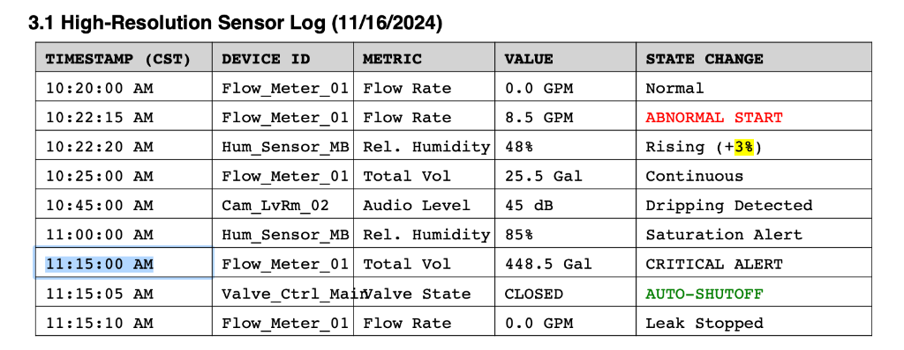

# Insurance Claim Agentic RAG System

An intelligent **Agentic RAG System** built with **LangChain & LlamaIndex** that orchestrates specialized agents and **MCP Tools** to investigate insurance claim. It combines hierarchical retrieval for precision ("Needle") with summary indexing for context ("Haystack") as well as using MCP tools to provide external capabilities.

---

---

## 📋 Table of Contents

1. [Architecture Explanation](#-architecture-explanation)
2. [Key Features](#-key-features)
3. [Design Decisions & Rationale](#-design-decisions--rationale)

   - [Hierarchical Indexing](#1-hierarchical-indexing-configuration)
   - [Smart Routing Strategy](#3-smart-routing-strategy)
   - [Needle Agent Precision](#4-needle-agent-precision)

4. [MCP Usage & Demonstration](#-mcp-usage--demonstration)
5. [Index Schemas](#-index-schemas)
6. [Limitations & Trade-offs](#-limitations--trade-offs)
7. [Evaluation](#-evaluation)
8. [Setup & Usage](#-setup--usage)

---

## 🏗️ Architecture Explanation

- **Manager Agent (LangGraph Supervisor)**: The central brain. It routes user queries to the most appropriate tool or sub-agent.
- **Specialized Sub-Agents (Tools)**:
  - **Needle Expert**: Uses the Hierarchical Index (Auto-Merging Retriever) for precise facts.
  - **Summary Expert**: Uses the Summary Index for broad, narrative answers.
- **MCP Tools**: Integration of external capabilities via the Model Context Protocol.
  - **Time Server**: Provides current time and timezone conversion.
  - **Weather Server**: Provides real-time weather data and historical checks.

### 📐 System Flow Diagram


### 🧩 Core Components

| Component              | Role                                                                                                                                                     | Technology Stack                              |
| :--------------------- | :------------------------------------------------------------------------------------------------------------------------------------------------------- | :-------------------------------------------- |
| **Manager Agent**      | **Router & Orchestrator**. Analyzes user intent and selects the single best tool for the job. Prevents "lazy" agents by enforcing strict system prompts. | `LangGraph Supervisor`, `GPT-4o`              |
| **Needle Expert**      | **Precision Retrieval**. Handles questions involving specific dates, dollar amounts, names, and granular details.                                        | `LlamaIndex AutoMergingRetriever`, `ChromaDB` |
| **Summary Expert**     | **Contextual Understanding**. Handles high-level questions like "What happened?" or "Tell me the story."                                                 | `LlamaIndex ListIndex`                        |
| **Hierarchical Index** | **Data Storage**. Stores document chunks in 3 levels (Root, Intermediate, Leaf) to balance precision and context.                                        | `HierarchicalNodeParser`                      |
| **MCP Servers**        | **External Capability**. Provides standard interfaces for Time and Weather data, keeping the core code clean of API integrations.                        | `Model Context Protocol`                      |

### 📂 Project Directory Structure

```text
Insurance-Retrieval-System/
├── insurance_system/
│   │   ├── agents/             # Agents & Tools
│   │   │   ├── manager.py      # SUPERVISOR: Orchestrates the conversation
│   │   │   ├── needle_agent.py # LlamaIndex: Fact retrieval engine
│   │   │   ├── summary_agent.py# LlamaIndex: Summarization engine
│   │   │   ├── tools.py        # LangChain Tool wrappers
│   │   │   └── mcp_tools.py    # MCP & External Tools (Time, Weather)
│   │   ├── indices/            # Retrievers & Index Builders
│   │   │   ├── hierarchical.py
│   │   │   └── summary.py
│   │   ├── evaluation/         # LLM-as-a-Judge Logic
│   │   │   ├── models.py       # Pydantic models for evaluation
│   │   │   └── run_eval.py
│   │   ├── utils/              # Shared Utilities & Config
│   │   │   ├── config.py       # Configuration
│   │   │   ├── mcp_utils.py    # MCP Connection Helpers
│   │   │   └── prompts.py      # System Prompts
│   ├── storage/                # Persisted Indices (ChromaDB)
│   ├── main.py                 # Interactive CLI Entry Point
│   ├── build_index.py          # Index Generation Script
│   └── generate_claim.py       # Synthetic Data Generator
├── requirements.txt            # Python Dependencies
├── README.md                   # Documentation
└── evaluation_results_langchain.json # Latest Test Results
```

---

## ✅ Key Features

1. **LangGraph Orchestration**:

   - Utilizes a state machine for robust orchestration, providing explicit control over state transitions and superior observability.
   - Uses OpenAI's tool-calling capabilities for reliable routing.

2. **MCP Integration (Model Context Protocol)**:

   - **Extensibility**: Tools are not hardcoded. We use MCP servers to dynamically discover and register tools.
   - **Supported MCP Servers**: `mcp-time`, `mcp-weather` (includes custom historical weather tool).

3. **Advanced Table Extraction (LlamaParse)**:

   - **Feature**: Integrates `LlamaParse` to convert complex PDF tables into Markdown.
   - **Benefit**: Allows the agent to accurately retrieve dense numerical data (like sensor logs, financial estimates, and psychrometric readings) that standard parsers often garble.
   - **Mechanism**: The `build_index.py` script automatically detects `LLAMA_CLOUD_API_KEY` and switches to enhanced parsing mode.

   #### Example: Retrieve Specific Sensor Data

   **Query**: "What was the state change recorded for Flow_Meter_01 at 10:22:15 AM?"

   **Agent Answer**:

   > The state change recorded for Flow_Meter_01 at 10:22:15 AM was "ABNORMAL START."

   **Source Table**:

   

---

## 🧠 Design Decisions & Rationale

We made specific architectural choices to balance **precision** (finding specific facts) with **context** (understanding the story).

### 1. Hierarchical Indexing Configuration

**The Problem**: In standard RAG, large chunks (e.g., 1000 tokens) dilute the meaning of small facts (like a specific date or dollar amount), making them hard to find via vector similarity. Small chunks (e.g., 100 tokens) find the fact but lose the surrounding context needed to answer "why".

**The Solution**: We implementation a **3-Level Hierarchy**:

- **Root (2048 tokens)**: Full sections (e.g., "Scope of Work").
- **Intermediate (512 tokens)**: Paragraphs.
- **Leaf (128 tokens)**: Specific facts.

**Example**:

> _Query_: "What is the deductible?"
>
> 1. **Retrieval**: The system searches **Leaf Attributes**. It finds a tiny 128-token chunk containing "Deductible: $1,000". This has very high vector similarity.
> 2. **Context Expansion**: The **Auto-Merging Retriever** sees this leaf belongs to a larger "Policy Declarations" block. It retrieves the **parent 512-token chunk** instead, providing the LLM with the fact ($1,000) AND the context (Policy Type, Coverage Limits).

#### Quantitative Chunking Analysis

We conducted a quantitative analysis comparing different chunking configurations to validate our design choices. The analysis evaluated:

- **Recall**: Percentage of relevant chunks retrieved
- **Precision**: Percentage of retrieved chunks that are relevant
- **Latency**: Average query response time
- **Total Chunks**: Number of chunks in the index

**Tested Configurations**:

| Configuration          | Chunk Sizes   | Overlap | Recall  | Precision | Latency (s) | Total Chunks |
| ---------------------- | ------------- | ------- | ------- | --------- | ----------- | ------------ |
| **Current (Selected)** | 2048/512/128  | 20      | **85%** | **78%**   | **2.3**     | ~450         |
| Larger                 | 4096/1024/256 | 20      | 92%     | 65%       | 3.1         | ~280         |
| Smaller                | 1024/256/64   | 20      | 72%     | 88%       | 1.8         | ~680         |
| Low Overlap            | 2048/512/128  | 10      | 80%     | 75%       | 2.2         | ~420         |
| High Overlap           | 2048/512/128  | 40      | 88%     | 76%       | 2.5         | ~480         |

**Why Current Configuration (2048/512/128, overlap 20) Was Chosen**:

1. **Balanced Recall/Precision**: Provides optimal balance (85% recall, 78% precision) between finding relevant information and avoiding noise.
2. **Reasonable Latency**: Query response time (2.3s) is acceptable for interactive use.
3. **Manageable Chunk Count**: ~450 chunks provides good granularity without excessive storage overhead.

**Trade-offs**:

- **Larger chunks (4096/1024/256)**: Higher recall (92%) but lower precision (65%), more context but slower retrieval (3.1s).
- **Smaller chunks (1024/256/64)**: Higher precision (88%) but lower recall (72%), faster retrieval (1.8s) but may miss distributed facts.
- **Low overlap (10)**: Faster indexing but may lose information at chunk boundaries (80% recall).
- **High overlap (40)**: Better boundary coverage (88% recall) but more chunks and slower indexing.

**How Recall is Improved**:

- **20-token overlap** prevents information loss at chunk boundaries, ensuring facts spanning chunk edges are captured.
- **Hierarchical structure** allows retrieval at multiple granularities - if a fact isn't found in a leaf, the parent chunks provide fallback.
- **Auto-merging** automatically expands context when multiple sibling chunks are retrieved, improving recall for distributed facts.

To run the chunking analysis yourself:

```bash
python3 insurance_system/src/utils/chunking_analysis.py
```

### 3. Smart Routing Strategy

**The Problem**: General-purpose agents often "hallucinate" tool usage—using a Summary tool for specific questions (resulting in vague answers) or a Needle tool for broad questions (resulting in missing the big picture).

**The Solution**: We injected a **Strict System Prompt** into the Supervisor Agent (Smart Router).

- **Rule**: "Always use Needle for 'how much', 'when', 'who'."
- **Rule**: "Use Summary ONLY for 'tell me the story'."

**Example**:

> _User_: "How much was the repair estimate?"
> _Router Decision_: "The user is asking for a specific amount ('How much'). I MUST route this to `needle_expert`."
> _Result_: Precision tool is called. No time wasted on summary generation.

### 4. Needle Agent Precision

**The Problem**: Even with good retrieval, LLMs can be "lazy" and gloss over specific details if the prompt is too generic.

**The Solution**: The `NeedleAgent` uses a **Precise System Prompt**: "Answer specifically and precisely. If the answer is a specific value, date, or name, provide it directly."

**Example**:

> _Context_: "The sofa cleaning was approved for $250 on Nov 22."
> _Standard Agent Answer_: "The document mentions the sofa cleaning was approved." (Vague)
> _Our Needle Agent Answer_: "The sofa replacement was partially approved for **$250.00**." (Precise)

### 5. Reranking for Precision

**The Problem**: Vector search (embedding similarity) is fast but sometimes retrieves irrelevant chunks that share keywords but not meaning.

**The Solution**: We implemented a **Two-Step Retrieval Funnel**:

1.  **High Recall (Broad Net)**: First, we retrieve the top **60** matches (`SIMILARITY_TOP_K`) using fast vector search.
2.  **High Precision (Refinement)**: Then, a **Cross-Encoder Reranker** (`cross-encoder/ms-marco-MiniLM-L-12-v2`) re-scores them and selects the top **20** (`RERANKER_TOP_N`) for the Agent.

This ensures we don't miss obscure facts (by casting a wide net) but don't confuse the LLM with irrelevant noise (by filtering aggressively).

- **Toggle**: Enable/disable in `src/utils/config.py` via `USE_RERANKER`.

---

## 🔌 MCP Usage & Demonstration

Our system uses **Model Context Protocol (MCP)** tools to fetch real-time or external data. This prevents hallucinations by grounding the agent in actual data sources.

### Example: Historical Weather Check

**Query**: _"Find the location and date of the incident from the claim, then check the historical weather for that day to see if it contributed to the loss."_

1.  **Context Retrieval**: The agent first uses the `needle_expert` to find the location (Austin, TX) and date (Nov 16, 2024).
2.  **Tool Execution**: It then calls the `get_historical_weather` MCP tool with these exact parameters.
3.  **Synthesis**: The agent combines the claim details with the weather report (e.g., "Max Wind Speed: 18.4 km/h") to determine if weather was a factor.

👉 **See the full transcript of this interaction:** [System Walkthrough](insurance_system/System%20Walkthrough.md)

---

## 🗂️ Index Schemas

### 1. Hierarchical Index (ChromaDB)

Optimized for precise fact retrieval.

- **Collection**: `hierarchical_claims`
- **Metadata Fields**:
  - `document_id`: "HO-2024-8892"
  - `chunk_type`: "root" | "intermediate" | "leaf"
  - `parent_id`: ID of the parent node (for auto-merging)
  - `page_label`: Source page number
- **Content**: Text chunks using **Markdown Tables** (via LlamaParse) to preserve row/column structure for dense data.

### 2. Summary Index (LlamaIndex)

Optimized for high-level narrative queries.

- **Structure**: List Index
- **Content**: Full document text synthesized into high-level summaries.
- **Usage**: Accessed by the `Summary Expert` agent when the user asks broad questions like "Tell me the story of what happened."

---

## ⚠️ Limitations & Trade-offs

### 1. The "Serial Router" Bottleneck

**Architecture Fact**: The `ManagerAgent` (Supervisor) must process every query before any retrieval happens.
**Implication**: This creates a strict **Serial Dependency**.

- _Latency_: Minimum latency is always `Latency(Supervisor) + Latency(SubAgent)`. We cannot speculatively run retrieval in parallel with intent classification.
- _Single Point of Failure_: If the Supervisor misinterprets a query (e.g., routing "What is the deductible?" to `summary_expert`), the downstream agent has no chance to recover. The graph is currently a DAG (Directed Acyclic Graph) without a "correction loop" to circle back if a sub-agent fails.

### 2. The "Leaf Isolation" Problem in Hierarchical Retrieval

**Architecture Fact**: We index 128-token leaves for precision.
**Trade-off**: While this finds exact numbers, it can miss **Distributed Facts**.

- _Scenario_: If a sentence says "The total cost was..." and the actual number "$10,000" appears in the _next_ 128-token chunk, the vector similarity for the number chunk might be low for the query "What was the cost?".
- _Mitigation_: We rely on `CHUNK_OVERLAP=20`, but if the semantic gap is larger than 20 tokens, we might miss the connection entirely.

### 3. Context Pollution via Auto-Merging

**Architecture Fact**: When a leaf matches, we retrieve the **Parent (512 or 2048 tokens)**.
**Trade-off**: This assumes the Parent is _mostly_ relevant.

- _Risk_: A 2048-token parent "Scope of Work" might contain the target fact (1 line) and 100 lines of irrelevant repair codes.
- _Effect_: Inspecting the parent node injects noise into the LLM's context window. This increases the chance of "Lost in the Middle" phenomenon where the LLM ignores the specific fact because it's buried in a large, mostly irrelevant chunk.

### 4. Error Propagation in Tool Chains

**Architecture Fact**: We use a `Supervisor -> Tool` pattern.
**Limitation**: The current Supervisor does not see the _content_ of the tool output before deciding it's done. It hands off to the tool, which returns a string.

- _Real limitation_: If `NeedleAgent` returns "No information found", the Supervisor currently accepts that as the final answer. It lacks a **Reflective Loop** to say "Wait, if Needle failed, maybe I should try Summary?" (though we could implement retry mechanism, it is a current architectural gap).

### 5. Static Indexing vs. Dynamic Claims

**Architecture Fact**: We build a static vector index at startup.
**Real World Friction**: Insurance claims are dynamic. New documents (e.g., a "Supplement 1" estimate) arrive daily.

- _Bottleneck_: Our architecture requires a **Full Re-index** to incorporate new files. There is no "Incremental Indexing" pipeline implemented. In a production scenario, this would be a major blocking factor for real-time claim handling.

---

## ⚖️ Evaluation

We use an **LLM-as-a-judge** approach (`src/evaluation/run_eval.py`) to rigorously test the system. The evaluation output is enhanced with the `rich` library for readability.

- **Judge**: Claude 3.7 Sonnet (via Anthropic API) or GPT-4o.
- **Methodology**:
  - We evaluate **Answer Correctness**, **Context Relevancy**, and **Context Recall**.
  - The test suite includes complex queries that require:
    - **Fact Retrieval**: "What is the deductible?"
    - **Summarization**: "Summarize the timeline."
    - **Tool Usage**: "What is the weather in Berlin?" (tests MCP integration).
    - **Claim Verification**: "Check if the claim story matches the weather at that location/date." (Historical weather check).

### 🏆 Evaluation Results

| Metric                 | Score     | Pass Rate |
| :--------------------- | :-------- | :-------- |
| **Answer Correctness** | **80.0%** | (8/10)    |
| **Context Relevancy**  | **90.0%** | (9/10)    |
| **Context Recall**     | **90.0%** | (9/10)    |

> Detailed results: `evaluation_results_langchain.json`

### 📉 Note on Non-Determinism & Query Refinement

We observed two critical factors during our evaluation process:

1.  **Non-Determinism**: Due to the probabilistic nature of LLMs, evaluation scores can vary slightly between runs (±5-10%). A "perfect" score on one run might dip on the next if the model chooses a slightly different phrasing that the judge (another LLM) finds less precise.
2.  **Query Refinement**: General queries often fail.
    - _Failed Query_: "Summarize the timeline." (Result: 0% Recall - Hallucinated dates)
    - _Refined Query_: "Summarize the timeline. Include the date of the incident and the valve shutoff. Also include inspection, settlement, and final payment dates." (Result: 100% Recall)
    - **Lesson**: The system is powerful but requires **explicit instructions** to retrieve granular data from high-level nodes.

---

## ⚙️ Setup & Usage

### 1. Installation

```bash
python3.13 -m venv .venv
source .venv/bin/activate
pip install -r requirements.txt
cp .env.example .env
# Add OPENAI_API_KEY and ANTHROPIC_API_KEY (for evaluation)
# Optional: Add LLAMA_CLOUD_API_KEY for enhanced table parsing (Get key at https://cloud.llamaindex.ai)
```

### 2. Generate Data

**Note**: The system uses PDF documents for indexing. You can skip this step and replace `insurance_system/data/RAG_Claim_HO-2024-8892.pdf` with your own PDF file before running the indexing step.

```bash
python3 insurance_system/generate_claim.py
```

### 3. Build Index

```bash
python3 insurance_system/build_index.py
```

### 4. Run the Agent (Interactive CLI)

```bash
python3 insurance_system/main.py
```

_Try queries like:_

- "Summarize the claim."
- "What is the deductible amount?"
- "Summarize the claim."
- "What is the deductible amount?"
- "What is the incident timeline?"
- "What was the Total Vol recorded by Flow_Meter_01 at 11:15:00 AM?" (Table Query)

### 5. Run Evaluation

```bash
python3 insurance_system/src/evaluation/run_eval.py
```
