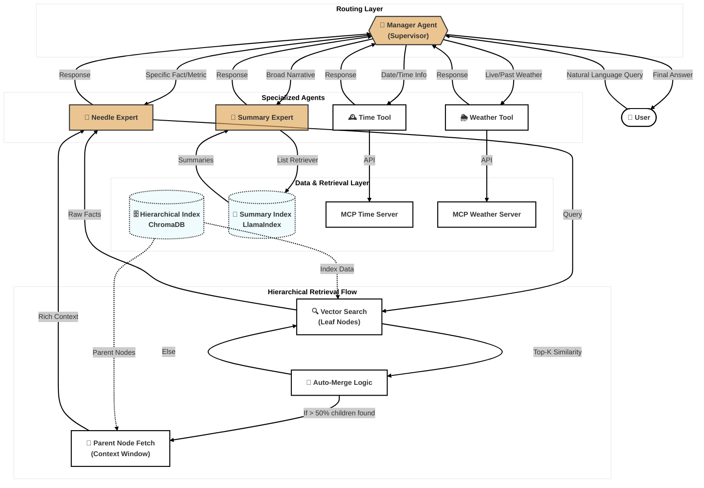

# Architecture Diagram

```mermaid
---
config:
  layout: dagre
  theme: neo
---
flowchart TB
 subgraph subGraph0["<b>Routing Layer</b>"]
        Supervisor{{"<b>🤖 Manager Agent<br>(Supervisor)</b>"}}
  end
 subgraph subGraph1["<b>Specialized Agents</b>"]
        NeedleAgent["<b>📍 Needle Expert</b>"]
        SummaryAgent["<b>📝 Summary Expert</b>"]
        TimeTool["<b>🕰️ Time Tool</b>"]
        WeatherTool["<b>🌦️ Weather Tool</b>"]
  end
 subgraph subGraph2["<b>Data &amp; Retrieval Layer</b>"]
        ChromaDB[("<b>🗄️ Hierarchical Index<br>ChromaDB</b>")]
        SummaryInd[("<b>📑 Summary Index<br>LlamaIndex</b>")]
        MCPTime["<b>MCP Time Server</b>"]
        MCPWeather["<b>MCP Weather Server</b>"]
  end
    User(["<b>👤 User</b>"]) -- Natural Language Query --> Supervisor
    Supervisor -- Specific Fact/Metric --> NeedleAgent
    Supervisor -- Broad Narrative --> SummaryAgent
    Supervisor -- Date/Time Info --> TimeTool
    Supervisor -- Live/Past Weather --> WeatherTool

    subgraph subGraphRetrieval["<b>Hierarchical Retrieval Flow</b>"]
            direction TB
            LeafSearch["<b>🔍 Vector Search<br>(Leaf Nodes)</b>"]
            MergeLogic["<b>🔄 Auto-Merge Logic</b>"]
            ParentFetch["<b>📄 Parent Node Fetch<br>(Context Window)</b>"]

            LeafSearch -->|"Top-K Similarity"| MergeLogic
            MergeLogic -->|"If > 50% children found"| ParentFetch
            MergeLogic -->|"Else"| LeafSearch
    end

    NeedleAgent -- "Query" --> LeafSearch
    ParentFetch -->|"Rich Context"| NeedleAgent
    LeafSearch -->|"Raw Facts"| NeedleAgent

    ChromaDB -.->|"Index Data"| LeafSearch
    ChromaDB -.->|"Parent Nodes"| ParentFetch

    SummaryAgent -- List Retriever --> SummaryInd
    TimeTool -- API --> MCPTime
    WeatherTool -- API --> MCPWeather

    SummaryInd -- Summaries --> SummaryAgent
    NeedleAgent -- Response --> Supervisor
    SummaryAgent -- Response --> Supervisor
    TimeTool -- Response --> Supervisor
    WeatherTool -- Response --> Supervisor
    Supervisor -- Final Answer --> User

     Supervisor:::agent
     NeedleAgent:::agent
     SummaryAgent:::agent
     ChromaDB:::storage
     SummaryInd:::storage
    classDef storage fill:#6cdbea1c, stroke:#333, stroke-width:2px, stroke-dasharray:2
    classDef agent fill:#dea452a1, stroke:#333, stroke-width:2px, stroke-dasharray:0
```
