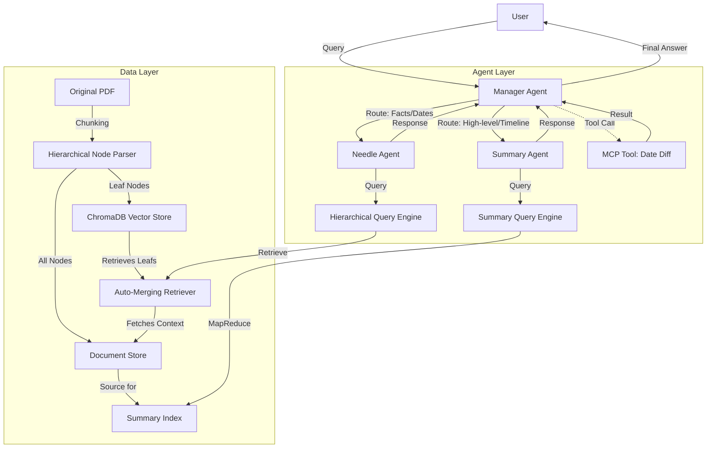

# Architecture Diagram

```mermaid
graph TD
    User[User] -->|Query| Manager[Manager Agent]
    
    subgraph "Data Layer"
        PDF[Original PDF] -->|Chunking| HNP[Hierarchical Node Parser]
        HNP -->|Leaf Nodes| Chroma[ChromaDB Vector Store]
        HNP -->|All Nodes| DocStore[Document Store]
        
        Chroma -->|Retrieves Leafs| AMR[Auto-Merging Retriever]
        AMR -->|Fetches Context| DocStore
        
        DocStore -->|Source for| SumIndex[Summary Index]
    end
    
    subgraph "Agent Layer"
        Manager -->|Route: Facts/Dates| Needle[Needle Agent]
        Manager -->|Route: High-level/Timeline| Summary[Summary Agent]
        
        Needle -->|Query| NeedleEngine[Hierarchical Query Engine]
        NeedleEngine -->|Retrieve| AMR
        
        Summary -->|Query| SumEngine[Summary Query Engine]
        SumEngine -->|MapReduce| SumIndex
        
        Manager -.->|Tool Call| Calc[MCP Tool: Date Diff]
    end
    
    Needle -->|Response| Manager
    Summary -->|Response| Manager
    Calc -->|Result| Manager
    
    Manager -->|Final Answer| User
```
